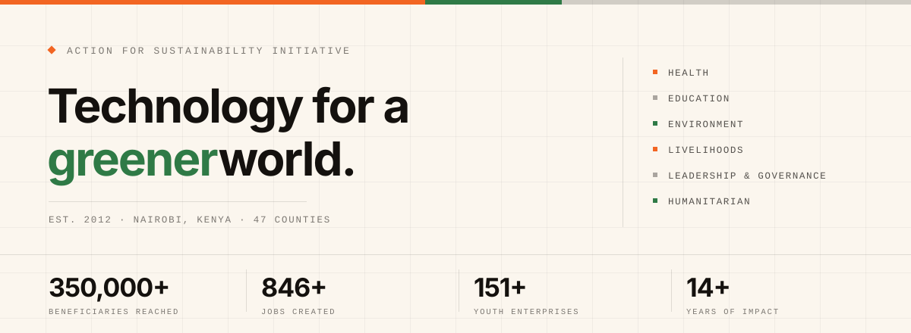

<picture>
  <source media="(prefers-color-scheme: dark)" srcset="assets/banner-dark.svg">
  
</picture>

<br>

**Action for Sustainability Initiative** is a lean, technology-backed Kenyan NGO working across health,
education, environment, leadership and livelihoods. We start where communities are — then we write the
software that carries that work from one county to forty-seven.

[**afosi.org**](https://afosi.org) &nbsp;·&nbsp; [Programs](https://afosi.org/projects.html) &nbsp;·&nbsp; [Platforms](https://afosi.org/platforms.html) &nbsp;·&nbsp; [Team](https://afosi.org/team.html) &nbsp;·&nbsp; [Partner with us](https://afosi.org/contact.html) &nbsp;·&nbsp; [Donate](https://afosi.org/donate.html)

---

## Grassroots trust. Engineered to scale.

Most NGOs pick one. We run both halves on purpose.

The first half is slow: twelve years of showing up in Kibera, Mukuru, Kwale and beyond, listening before
programming, with youth and women at the centre. The second half is fast: we design, ship and maintain our
own platforms, so an intervention that works in one county becomes a system that works in forty-seven —
tracked, repeatable, and still recognisably human on the ground.

> **Vision** — a world where every young person, regardless of gender, ability or background, can harness
> their full potential to build sustainable, thriving communities.
>
> **Mission** — to promote actions geared towards harnessing and protecting the full potential of youth and
> women through innovation, technology and community-led solutions.

**Integrity** — we do what we say, and measure whether it worked. &nbsp;✦&nbsp;
**Innovation** — technology in service of people, never the other way round. &nbsp;✦&nbsp;
**Inclusion** — youth, women and the marginalised lead the work. &nbsp;✦&nbsp;
**Sustainability** — impact that outlasts the funding cycle.

---

## The platforms

Four products, built and operated in-house. This is the delivery layer underneath every program below.

**[Kenya Youth Climate Hub](https://kenyayouthclimatehub.org)** — the national digital home of Kenya's youth
climate movement, connecting young climate actors to data, funding and coordinated advocacy.
<br><sub>CLIMATE · kenyayouthclimatehub.org</sub>

**[Kiongozi Platform](https://kiongozi.org)** — leadership, governance and green-economy training for Kenyans
aged 15–35, linking learners to opportunities and community data.
<br><sub>CIVIC LEARNING · kiongozi.org</sub>

**[Afosi Hub](https://afosihub.com)** — a digital innovation sandbox where youth move from theory to shipping
real software, AI and civic-tech, and where youth enterprises launch, track and grow.
<br><sub>ENTERPRISE · afosihub.com</sub>

**[Kiongozi Chat](https://play.google.com/store/apps/details?id=com.kiongozi.mobile)** — an AI-powered civic
education and social learning app covering governance, the Constitution and the green economy. Kiongozi, in
your pocket.
<br><sub>MOBILE · Google Play</sub>

---

## The programs

Eight initiatives across six pillars — **Health, Education, Environment, Livelihoods, Leadership &
Governance, Humanitarian** — each designed to be measured, scaled and sustained rather than delivered once.

**We Lead** — SRH-R leadership for young women living with HIV, with disabilities, or affected by
displacement.
<br><sub>ONGOING · KENYA · 500+ REACHED</sub>

**The M.A.T.H Project** — *Mazingira, Afya, Tumaini na Haki yetu.* Environment, health, hope and rights,
alongside advocacy on Kenya's Education for Sustainable Development policy.
<br><sub>2025–2028 · 60 APBET SCHOOLS, KIBERA & MUKURU · 10,000+ REACHED</sub>

**Sheria ya Vijana** — skills, leadership and participation in the green and digital economy, through
apprenticeships, mentorship and youth-led enterprise grants.
<br><sub>ONGOING · NAIROBI & KWALE · 5,875 REACHED</sub>

**Youth Voices Lab** — *Unheard to Influential.* AI-driven storytelling and policy advocacy that turns young
women living with HIV and with disabilities from subjects of policy into authors of it.
<br><sub>12 MONTHS · MUKURU, NAIROBI · 150+ REACHED</sub>

**Robotics & Creative Coding** — robotics, creative coding and digital innovation in informal settlements,
with STEM Impact Center Kenya.
<br><sub>12 MONTHS · NAIROBI · 300+ REACHED</sub>

**Forest Explorer** — game-based learning: curriculum content rebuilt as an explorable world of quests,
reward loops and virtual ecosystems.
<br><sub>ONGOING · KENYA · 100+ REACHED</sub>

**AI-Powered Music-Based Learning** — lessons set to music and cut into 30-second videos built for
short-form platforms.
<br><sub>COMING SOON · KENYA · 100+ REACHED</sub>

**YOMA** — a digital marketplace giving young people a digital identity to learn, earn and impact their
communities.
<br><sub>CLOSED · NAIROBI, KISUMU & MOMBASA · 69,000 REACHED</sub>

---

## How we build

Every platform we run started as a community problem, not a product idea. Our own team writes, ships and
maintains the software — which is why a fix that lands in one ward can be in every county by the end of the
quarter.

```js
// impact.js — run daily since 2012
const problem = "barriers facing youth & women";

const solution = afosi.programs
  .filter(p => p.communityLed)
  .map(p => p.pair(technology, trust));

while (!world.isSustainable()) {
  solution.iterate();
  impact.measure();
}

return hope; // 69,000+ youth and counting
```

**In the open on this account**

- [**salama-lm**](https://github.com/Action-For-Sustainability-Initiative/salama-lm) — cross-lingual alignment
  transfer in a 48M-parameter bilingual (English/Kiswahili) transformer, trained from scratch. Groundwork for
  civic tools that speak the language people actually use.

---

## Three ways to back the work

**Fund** — resource a program or a platform, and get transparent, data-backed reporting on what your money
moved. &nbsp;✦&nbsp; **Collaborate** — co-design and co-deliver, pairing your networks and expertise with our
reach and tools. &nbsp;✦&nbsp; **Volunteer** — lend skills, from mentorship to engineering, to youth and women
building their futures.

> Our partners don't just fund outputs — they help us build the digital infrastructure that keeps impact going
> long after a project ends.

Backed by **We Lead · Udada Imara · SYO · RAI · PYWV · NYECBO · Inuka · GEM Trust · Dayo · CSA**

---

<sub>
<b>Action for Sustainability Initiative (AFOSI)</b> · Manga House, Kiambere Road, Upper Hill, Nairobi, Kenya<br>
<a href="mailto:info@afosi.org">info@afosi.org</a> · <a href="tel:+254115963306">+254 115 963 306</a> ·
<a href="https://www.linkedin.com/company/action-for-sustainability-initiative/">LinkedIn</a> ·
<a href="https://www.instagram.com/afosi_ke">Instagram</a> ·
<a href="https://www.facebook.com/share/19aj6y3Pyx/">Facebook</a> ·
<a href="https://www.tiktok.com/@afosi77">TikTok</a><br>
<i>A sustainable world.</i>
</sub>
